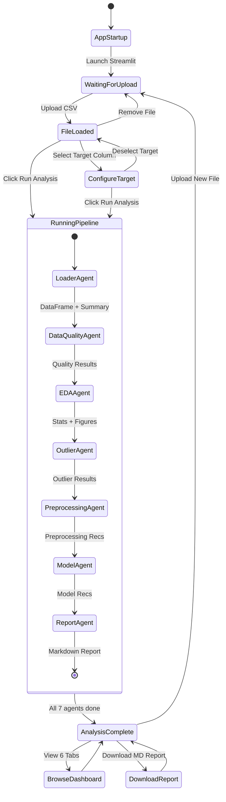
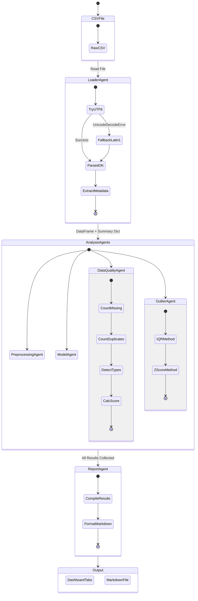
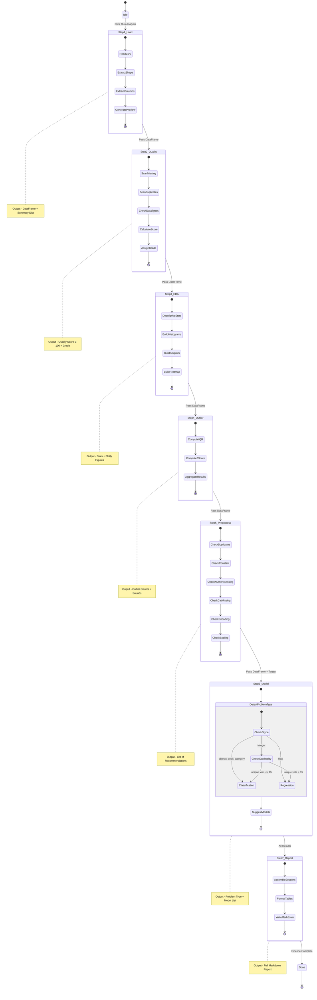
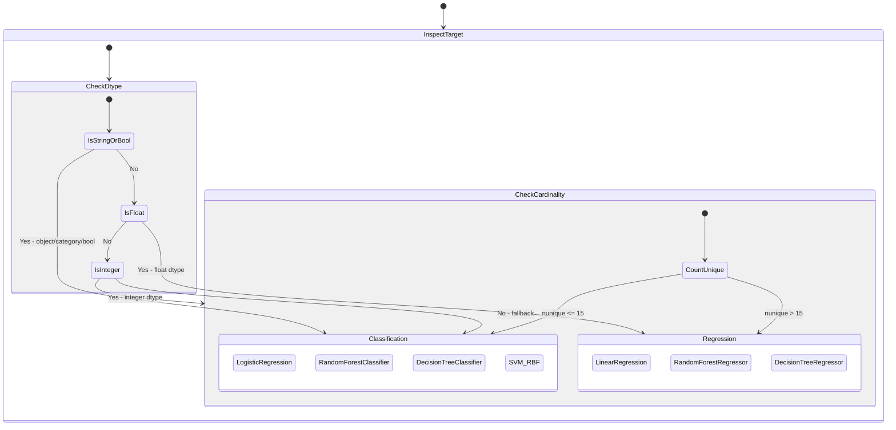
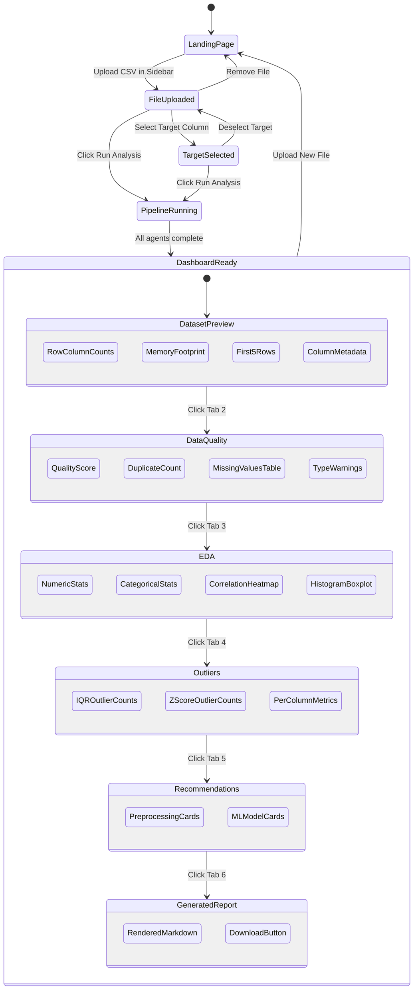
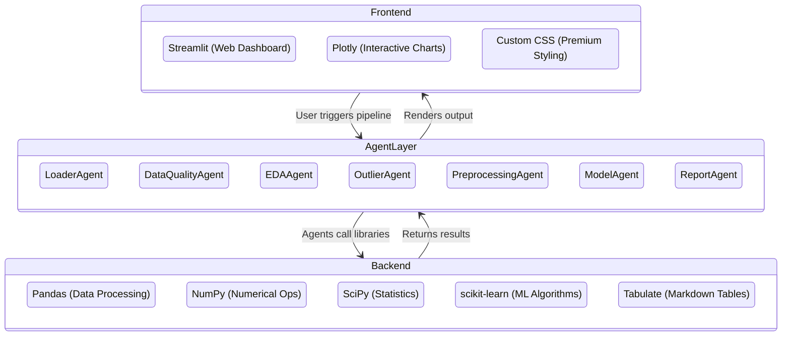

<p align="center">
  <h1 align="center">🔍 Dataset Explorer Agent</h1>
  <p align="center">
    <strong>An offline-first, multi-agent system for automated CSV data profiling, quality grading, exploratory analysis, outlier detection, and ML model recommendations.</strong>
  </p>
  <p align="center">
    
    
    
    
    
  </p>
</p>

---

> **🔒 Fully Offline** — This application does **not** use any LLM, OpenAI API, Gemini API, Claude API, Hugging Face API, or any external AI service. All computations, charts, and recommendations are generated using **deterministic statistical heuristics**, scikit-learn, and local packages.

---

## 📑 Table of Contents

1. [Overview](#-overview)
2. [Architecture & Flow Diagram](#-architecture--flow-diagram)
3. [Agent Pipeline Workflow](#-agent-pipeline-workflow)
4. [Project Structure](#-project-structure)
5. [Agent Deep Dive](#-agent-deep-dive)
6. [Installation & Setup](#-installation--setup)
7. [How to Run](#-how-to-run)
8. [Dashboard Walkthrough](#-dashboard-walkthrough)
9. [Sample Data & Testing](#-sample-data--testing)
10. [Tech Stack](#-tech-stack)
11. [Troubleshooting](#-troubleshooting)

---

## 🌟 Overview

**Dataset Explorer Agent** is a multi-agent data analysis pipeline that automates the tedious first steps of any data science project. Upload a CSV file and the system will:

- **Load & Profile** the dataset (rows, columns, types, memory usage)
- **Grade Data Quality** on a 0–100 scale (missing values, duplicates, type mismatches)
- **Run Exploratory Analysis** with interactive Plotly charts (histograms, boxplots, correlation heatmaps)
- **Detect Outliers** using IQR and Z-score methods
- **Recommend Preprocessing** steps (imputation, encoding, scaling)
- **Suggest ML Models** with pros, cons, and justifications
- **Generate a Markdown Report** summarizing everything

---

## 🏗️ Architecture & Flow Diagram

### 1. Application State Machine

The overall application moves through a clear set of states, from startup to final output:



### 2. Agent Data Flow

Each agent receives its input, does its work, and passes output to the next:



---

## ⚡ Agent Pipeline Workflow

The system follows a **sequential multi-agent pipeline** pattern. Each agent has a single responsibility and passes its output forward.

### 3. Sequential Pipeline State Machine

This diagram shows the exact order of execution inside `app.py` when you click **"Run Complete Analysis"**:



### Pipeline Step Summary

| Step | Agent | Input | Output | Key Algorithms |
|------|-------|-------|--------|----------------|
| 1 | **LoaderAgent** | CSV file/buffer | `DataFrame` + summary dict | UTF-8 → Latin-1 fallback encoding |
| 2 | **DataQualityAgent** | DataFrame | Quality score, grade, missing/duplicate stats | Weighted penalty scoring (0–100) |
| 3 | **EDAAgent** | DataFrame | Descriptive stats + Plotly figures | Pearson correlation, histograms |
| 4 | **OutlierAgent** | DataFrame | Outlier counts per column | IQR (1.5×), Z-score (|Z| > 3) |
| 5 | **PreprocessingAgent** | DataFrame | List of recommendation dicts | Rule-based heuristic checks |
| 6 | **ModelAgent** | DataFrame + target column | Problem type + model suggestions | Cardinality/dtype heuristics |
| 7 | **ReportAgent** | All agent outputs | Markdown report string | Template assembly |

---

## 📂 Project Structure

```
dataset_explorer_agent/
│
├── app.py                        # Main Streamlit dashboard (entry point)
├── generate_sample_data.py       # Script to create a synthetic test CSV
├── test_agents.py                # CLI test — runs all agents end-to-end
├── requirements.txt              # Python package dependencies
├── README.md                     # This documentation
│
├── agents/                       # Specialized deterministic pipeline agents
│   ├── __init__.py               # Package init
│   ├── loader_agent.py           # Step 1: CSV loading + metadata extraction
│   ├── quality_agent.py          # Step 2: Missing values, duplicates, type checks
│   ├── eda_agent.py              # Step 3: Stats, histograms, boxplots, heatmaps
│   ├── outlier_agent.py          # Step 4: IQR + Z-score outlier detection
│   ├── preprocessing_agent.py    # Step 5: Preprocessing action recommendations
│   ├── model_agent.py            # Step 6: ML problem detection + model suggestions
│   └── report_agent.py           # Step 7: Markdown report generation
│
├── utils/                        # Shared helper modules
│   ├── __init__.py
│   └── helpers.py                # Custom CSS injection for premium dashboard styling
│
├── reports/                      # Generated analysis reports
│   └── sample_report.md          # Reference output from test_agents.py
│
└── sample_data.csv               # Synthetic test dataset (150+ rows)
```

---

## 🔬 Agent Deep Dive

### 1️⃣ LoaderAgent (`loader_agent.py`)

**Purpose**: Safely loads CSV files into pandas DataFrames with encoding fallback.

| Method | Description |
|--------|-------------|
| `load_data(file)` | Reads CSV with UTF-8, falls back to Latin-1 on `UnicodeDecodeError` |
| `get_summary(df)` | Returns `shape`, `rows`, `columns` list, `num_columns`, and `preview` (first 5 rows) |

---

### 2️⃣ DataQualityAgent (`quality_agent.py`)

**Purpose**: Evaluates dataset cleanliness and assigns a quality grade.

**Quality Score Formula** (100-point scale):
```
Score = 100 - missing_penalty - duplicate_penalty - dtype_penalty

Where:
  missing_penalty  = min(total_missing_% × 2, 40)     # max 40 pts
  duplicate_penalty = min(duplicate_% × 3, 30)          # max 30 pts
  dtype_penalty     = min(incorrect_dtype_cols × 10, 30) # max 30 pts
```

**Quality Grades**:

| Score Range | Grade |
|-------------|-------|
| 85–100 | 🟢 Excellent |
| 70–84 | 🔵 Good |
| 50–69 | 🟡 Fair |
| 0–49 | 🔴 Poor |

**Type Detection Logic**: Samples up to 100 non-null values from each `object` column and tests if >80% parse as numeric (after stripping `$`, `%`, `,`) or datetime.

---

### 3️⃣ EDAAgent (`eda_agent.py`)

**Purpose**: Generates statistics and interactive Plotly visualizations.

| Method | Output |
|--------|--------|
| `get_descriptive_stats(df)` | Separate `.describe()` tables for numeric and categorical columns |
| `get_value_counts(df, col)` | Category, count, and percentage table for a categorical column |
| `plot_histogram(df, col)` | Interactive histogram with marginal boxplot |
| `plot_boxplot(df, col)` | Standalone interactive boxplot |
| `plot_correlation_heatmap(df)` | Pearson correlation matrix heatmap (requires ≥2 numeric columns) |

---

### 4️⃣ OutlierAgent (`outlier_agent.py`)

**Purpose**: Detects anomalous values using two complementary methods.

| Method | Formula | Threshold |
|--------|---------|-----------|
| **IQR** | Lower = Q1 − 1.5 × IQR, Upper = Q3 + 1.5 × IQR | Outside [Lower, Upper] |
| **Z-Score** | Z = (x − μ) / σ | \|Z\| > 3.0 |

Returns per-column statistics (mean, std, bounds, counts) and aggregate totals.

---

### 5️⃣ PreprocessingAgent (`preprocessing_agent.py`)

**Purpose**: Scans the DataFrame and produces actionable preprocessing recommendations.

| Check | Action | Condition |
|-------|--------|-----------|
| Duplicate rows | Remove duplicates | `duplicated().sum() > 0` |
| Constant columns | Drop column | `nunique() ≤ 1` |
| Missing numeric | Median imputation | Any numeric column has nulls |
| Missing categorical | Mode imputation | Any categorical column has nulls |
| Categorical encoding | Label encoding | Any `object`/`category`/`bool` columns exist |
| Feature scaling | StandardScaler | Any numeric columns exist; warns if std ratio > 10× |

Each recommendation includes `scope`, `action`, `recommended` (bool), and `reason`.

---

### 6️⃣ ModelAgent (`model_agent.py`)

**Purpose**: Detects ML problem type and suggests appropriate algorithms.

**Problem Detection Logic**:



**Recommended Models**:

| Classification | Regression |
|---------------|------------|
| Logistic Regression | Linear Regression |
| Random Forest Classifier | Random Forest Regressor |
| Decision Tree Classifier | Decision Tree Regressor |
| SVM (RBF Kernel) | — |

Each model includes **pros**, **cons**, and **why recommended**.

---

### 7️⃣ ReportAgent (`report_agent.py`)

**Purpose**: Compiles all agent outputs into a professional Markdown report with:
- Dataset overview with preview table
- Quality score and missing value breakdown
- Outlier analysis table
- Preprocessing recommendations with justifications
- Model suggestions with pros/cons
- Conclusion with next-step pipeline recommendations

---

## 📦 Installation & Setup

### Prerequisites

- **Python 3.9+** installed ([download](https://www.python.org/downloads/))
- **pip** package manager (included with Python)

### Step-by-Step Setup

```bash
# 1. Clone or navigate to the project directory
cd "d:/Kaggle Hackathon/dataset_explorer_agent"

# 2. (Optional) Create a virtual environment
python -m venv venv

# On Windows:
venv\Scripts\activate

# On macOS/Linux:
source venv/bin/activate

# 3. Install all dependencies
pip install -r requirements.txt
```

### Dependencies (`requirements.txt`)

| Package | Version | Purpose |
|---------|---------|---------|
| `streamlit` | ≥1.30.0 | Web dashboard framework |
| `pandas` | ≥2.0.0 | Data manipulation and analysis |
| `numpy` | ≥1.24.0 | Numerical operations |
| `matplotlib` | ≥3.7.0 | Static plotting (dependency) |
| `scikit-learn` | ≥1.2.0 | ML algorithms and preprocessing |
| `scipy` | ≥1.10.0 | Statistical functions |
| `plotly` | ≥5.15.0 | Interactive visualizations |
| `tabulate` | ≥0.8.10 | Markdown table generation |

---

## 🚀 How to Run

### Option 1: Interactive Streamlit Dashboard (Recommended)

```bash
streamlit run app.py
```

This launches the web UI at **http://localhost:8501**. See the [Dashboard Walkthrough](#-dashboard-walkthrough) section below.

### Option 2: CLI Test Pipeline

Run the entire agent pipeline from the command line:

```bash
# Step 1: Generate synthetic test data
python generate_sample_data.py

# Step 2: Run all 7 agents end-to-end
python test_agents.py
```

**CLI output** prints each agent's results to the console and saves the report to `reports/sample_report.md`.

---

## 🖥️ Dashboard Walkthrough

### 4. User Interaction State Machine

This diagram shows every state transition in the Streamlit dashboard from the user's perspective:



### Dashboard Tabs

| Tab | Icon | Content |
|-----|------|---------|
| **Dataset Preview** | 📊 | Row/column counts, memory footprint, first 5 rows, column metadata (type, unique values, non-null count) |
| **Data Quality** | 🛡️ | Quality score (0–100) and grade, duplicate count, total missing cells, type inconsistency warnings, per-column missing breakdown |
| **Exploratory Analysis** | 📈 | Numerical and categorical descriptive statistics, Pearson correlation heatmap, column-level histogram + boxplot selector |
| **Outlier Detection** | 🎯 | Total IQR and Z-score outlier counts, per-column breakdown with mean, std, IQR bounds |
| **Recommendations** | 💡 | Preprocessing action cards (active vs. not needed) with scope and justification, ML model cards with pros/cons/rationale |
| **Generated Report** | 📄 | Full rendered Markdown report with download button |

---

## 🧪 Sample Data & Testing

### Generate Sample Data

```bash
python generate_sample_data.py
```

Creates `sample_data.csv` with:
- **150+ rows** with 6 columns (`passenger_id`, `age`, `salary`, `gender`, `city`, `purchased`)
- **Injected missing values**: 12 in `age`, 8 in `gender`
- **Injected outliers**: age values of 120, −5, and 105
- **Injected duplicates**: 4 duplicate rows
- **Constant column**: `city` (always "New York")
- **Currency column**: `salary` stored as string (`$XX,XXX` format) — triggers type detection

### Run CLI Tests

```bash
python test_agents.py
```

This will:
1. Load `sample_data.csv`
2. Run all 7 agents sequentially
3. Print results to console
4. Save `reports/sample_report.md`

### Expected Test Output

```
=== TESTING DATASET EXPLORER AGENT OFFLINE PIPELINE ===

Running LoaderAgent...
Shape loaded: (154, 6)
Columns: ['passenger_id', 'age', 'salary', 'gender', 'city', 'purchased']

Running DataQualityAgent...
Score: XX/100 (Good/Fair)
Duplicates: 4
Total Missing: 20

Running EDAAgent...
Numerical stats columns: ['age', 'purchased']
Categorical stats columns: ['passenger_id', 'salary', 'gender', 'city']

Running OutlierAgent...
Total IQR Outliers: X
Total Z-Score Outliers: X

Running PreprocessingAgent...
- Action: Remove duplicates, Recommended: True, ...
- Action: Drop constant columns, Recommended: True, ...
...

Running ModelAgent...
Target 'purchased' detected problem type: Classification
Target 'age' detected problem type: Regression

Running ReportAgent...
Sample report generated successfully.
```

---

## 🛠️ Tech Stack

### 5. Technology Layer Diagram



---

## ❓ Troubleshooting

| Issue | Solution |
|-------|----------|
| `ModuleNotFoundError` | Run `pip install -r requirements.txt` |
| Port 8501 in use | Use `streamlit run app.py --server.port 8502` |
| CSV encoding error | The LoaderAgent automatically falls back to Latin-1 encoding |
| No charts displayed | Ensure you have ≥2 numeric columns for correlation heatmap |
| "No target column" warning | Select a target column in the sidebar for ML recommendations |
| Large CSV slow to load | The system processes everything in-memory; consider sampling for 1M+ row datasets |

---

## 📄 License

This project is provided as-is for educational and hackathon purposes.

---

<p align="center">
  <strong>Built with ❤️ using Python, Streamlit, and Plotly — 100% Offline</strong>
</p>
